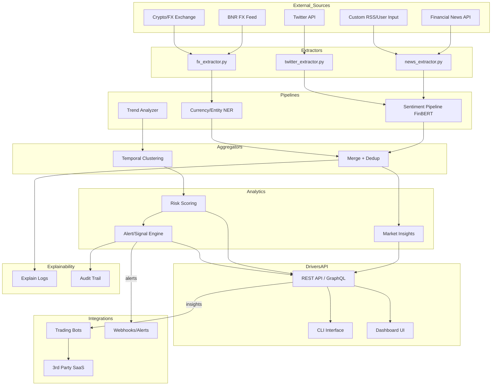

# AffectRON 🇷🇴

**Professional Financial Sentiment Analysis System for Romanian Markets**

Real-time sentiment analysis, market insights, and trading signals for RON, EUR, USD markets using advanced AI and financial data processing.

## 🏗️ Architecture Overview



## 🚀 Key Features

- **Multi-Currency Support**: RON, EUR, USD analysis
- **Real-time Data Processing**: BNR feeds, social media, news, market data
- **Advanced AI Models**: FinBERT for sentiment, NER for entity extraction
- **Professional APIs**: REST/GraphQL endpoints for enterprise integration
- **Trading Integration**: Direct bot connectivity and webhook alerts
- **Compliance Ready**: Full audit trails and explainable AI
- **Multi-Platform**: CLI tools, web dashboard, API access

## 🛠️ Technology Stack

- **Backend**: Python, FastAPI, PostgreSQL
- **AI/ML**: Transformers, FinBERT, spaCy, scikit-learn
- **Data Processing**: Apache Kafka, Redis, Celery
- **API Layer**: GraphQL, REST, WebSocket
- **Frontend**: React, TypeScript, D3.js
- **Infrastructure**: Docker, Kubernetes, AWS/GCP
- **Monitoring**: Prometheus, Grafana, ELK Stack

## 📁 Project Structure

```
AffectRON/
├── src/
│   ├── extractors/          # Data extraction modules
│   ├── pipelines/           # AI processing pipelines
│   ├── aggregators/         # Data aggregation logic
│   ├── analytics/           # Market insights engine
│   ├── api/                 # REST/GraphQL API
│   └── dashboard/           # Web UI components
├── infrastructure/          # Docker, K8s, CI/CD
├── models/                  # Pre-trained AI models
├── tests/                   # Comprehensive test suite
├── docs/                    # Technical documentation
└── examples/                # Integration examples
```

## 🎯 Target Markets

- **Romanian Financial Sector**: Banks, investment firms, trading platforms
- **Cryptocurrency Exchanges**: Real-time sentiment for crypto-fiat pairs
- **Forex Trading**: Professional sentiment analysis for EUR/RON, USD/RON
- **Financial Media**: News organizations and financial content platforms
- **Risk Management**: Corporate treasury and risk assessment teams

## 🔧 Quick Start

```bash
# Clone repository
git clone https://github.com/Gzeu/AffectRON.git
cd AffectRON

# Setup environment
python -m venv venv
source venv/bin/activate  # Windows: venv\Scripts\activate
pip install -r requirements.txt

# Configure environment
cp .env.example .env
# Edit .env with your API keys and database credentials

# Run development server
python -m src.api.main
```

## 📊 API Examples

```python
# Get sentiment analysis
GET /api/v1/sentiment/RON?timeframe=1h

# Market insights
GET /api/v1/insights/market?currency=EUR&risk_level=medium

# Real-time alerts
WS /ws/alerts?currencies=RON,EUR,USD
```

## 🤝 Contributing

We welcome contributions from developers, financial analysts, and AI researchers. See [CONTRIBUTING.md](CONTRIBUTING.md) for guidelines.

## 📄 License

Open Source - MIT License. See [LICENSE](LICENSE) for details.

## 🏢 Enterprise Support

For enterprise licensing, custom integrations, and professional support, contact: [enterprise@affectron.com]

---

**Built with ❤️ for the Romanian financial community**